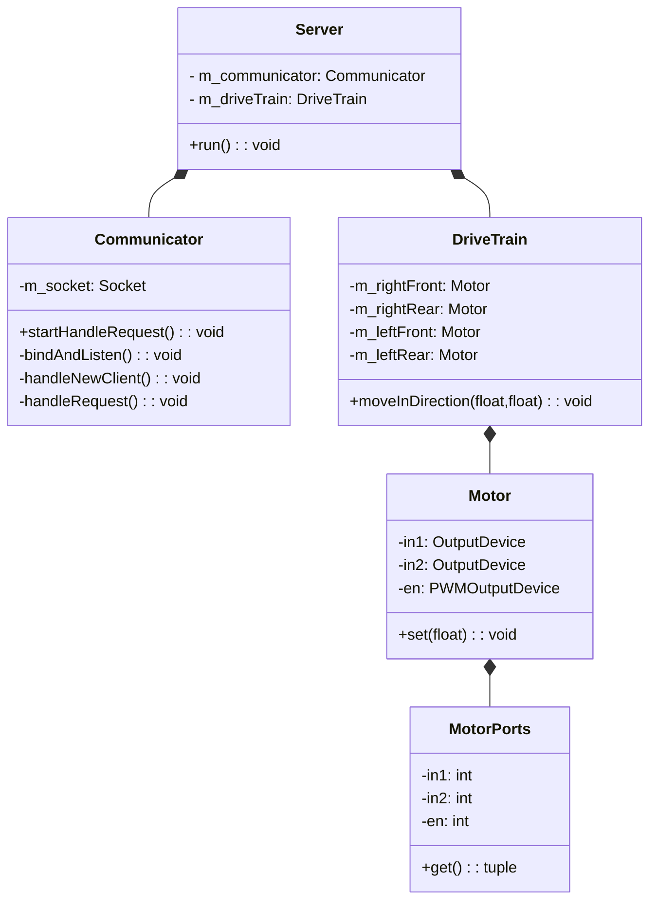
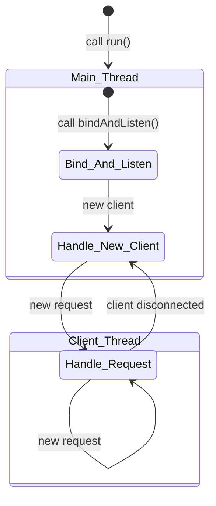

# adama project

[](https://mermaid.live/edit#pako:eNp9Ustu4zAM_BVBJxdofyCHLfJo6kuBBdrTrvfAWHQsQCYNWdrASPLvS1l2tkWL5qQhJzNDmmdds0G90o3jU92CD-ptU5GS3_r3axD8Rz08_FCb4qfnPrrBMiluVGhReT5wuMvkTSJti523fy0dVeATeDNMtN4BBfQzcYiHo4e-VS9gSTnmPte3SWBXlLGzxoZRdQhD9NghLRa7KcjT2Q6qXVjEvgP3eM2Mp4lxIb7si7VDmSX5N-A79CpT4MAxlx3XEN5NM8eUN4SZTIgyAyjZCx1RSd7F-O6D4YjD5blYqxqck9Hfu05qCd8iS_ycetZ4ThrleW_JpM1ZGrAOwzLSfnIoMygTSOPRN2bEi4Y6oZceRzKzV5n-n9KOn_fz9WbgtpeTDe3UntVnyTF_FTLzygTdgDxSd5sRprK-12LWgTVyc-fUqLSIdljplTwNNhBdqHRFV6FCDPw6Uq1XwUe8157jsV1A7A0E3FmQe-r0qgE3SLUH-sX8H6Msnf1LPvLp1q__AAiT9yE)